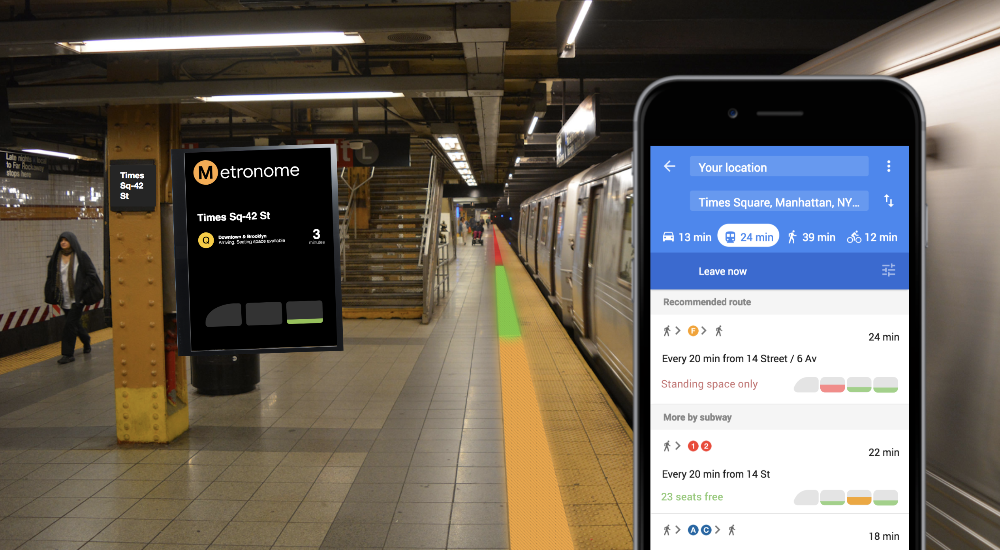
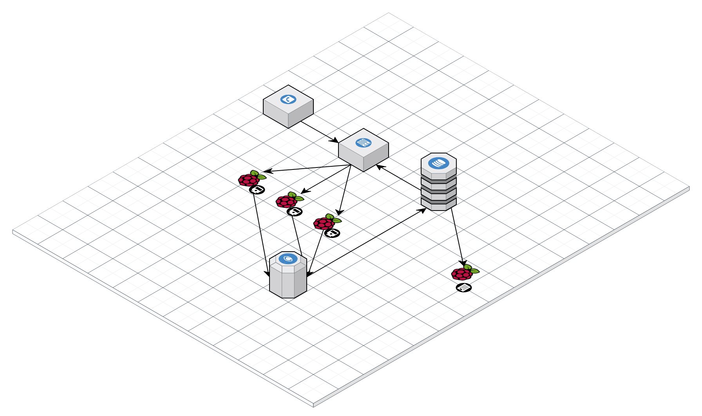
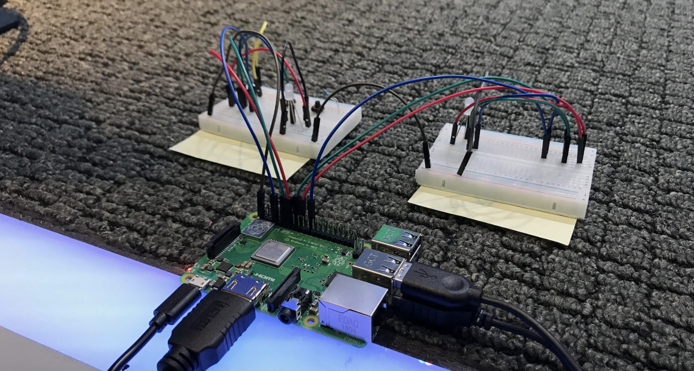

# Metronome
Improving the train riding experience for all New Yorkers!

With over 5.5 million daily riders, the NYC metro system is both a blessing but also a headache. How many times have you watched an empty subway car pass by you as it rolls into the station, just to be greeted by a jam-packed car? How many times have you moved down the platform in _hopes_ of ending up with an empty car?

Our team wanted to help New Yorkers experience a less crowded and more efficient commute. There are only a few seconds before each train leaves the station, but plenty of wait time on the platform. We sought out to provide commuters real-time ambient feedback about the capacity of the cars on their upcoming train.


## Ideal State



We envision a metro experience that would include LED strips on the platform signaling in real-time how full each car from the incoming train is. This status could also be integrated on an on-screen display or even within Google Maps.


## Implementation



For our prototype, we created a Flask webapp with routes to simulate when the subway car doors would close. We had a button on the webapp that triggers the security cameras (simulated via Raspberry Pi's with cameras) to take a picture and send it to the Google Cloud Vision API to detect the number of faces. This enabled us to get a rough estimate of how full a car was. This data is then sent up to a Firebase database (used for historical data storage).

The frontend side of our webapp was the display that could be put up on screens at the platform to provide an additional cue.

We used socket.io to trigger the Pi code that took pictures, which would then trigger the UI to automatically update on the Flask frontend.




On the platform (simulated via a Raspberry Pi with LEDs), we continually pull and parse data from Firebase to determine what colors to display on each LED.


## Development

Install the following python requirements (you can use virtualenv):
```
sudo pip install requests
sudo pip install python-firebase
sudo pip install flask
sudo pip install flask_socketio
```
